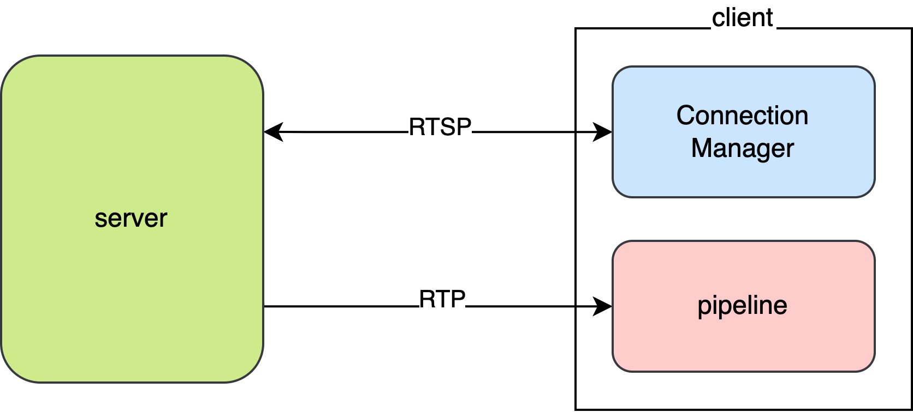

# Architecture

Now let's discuss how the architecture of our solution will look like.
It will be a little different from the RTMP to HLS architecture.
The main component will be the pipeline, which will ingest RTP stream and convert it to HLS. Beyond that we will also need a Connection Manager, which will be responsible for establishing an RTSP connection with the server.

When initializing, the pipeline will start a Connection Manager which starts an RTSP connection with the server. Once the connection is fully established, the pipeline will be notified.

Let's take a closer look on each of those components:

## Connection Manager
The role of the connection manager is to initialize RTSP session and start playing the stream.
It communicates with the server using the [RTSP requests](https://antmedia.io/rtsp-explained-what-is-rtsp-how-it-works/#RTSP_requests). In fact, we won't need many requests to start playing the stream - take a look at the desired message flow:

First we want to get the details of the video we will be playing, by sending the `DESCRIBE` method. 
Then we call the `SETUP` method, defining the transport protocol (RTP) and client port used for receiving the stream.
Now we can start the stream using `PLAY` method.

## Pipeline

The pipeline consists of a couple elements, each of them performing a specific media processing task. You can definitely notice some similarities to the pipeline described in the [RTMP architecture](02_RTMP_Introduction.md). However, we will only be processing video so only the video processing elements will be necessary.

We have already used the, `H264 Parser`, `MP4 H264 Payloader`, `CMAF Muxer` and `HLS Sink` elements in the RTMP pipeline, take a look at the [RTMP to HLS architecture](03_RTMP_SystemArchitecture.md) chapter for details of the purpose of those elements.

Let us describe briefly what is the purpose of the other components:

### UDP Source
This element is quite simple - it receives UDP packets from the network and sends their payloads to the next element.

### RTP SessionBin
RTP SessionBin is a Membrane's Bin, which is a Membrane's container used for creating reusable groups of elements. In our case the Bin handles the RTP session with the server, which has been set up by the Connection Manager.
