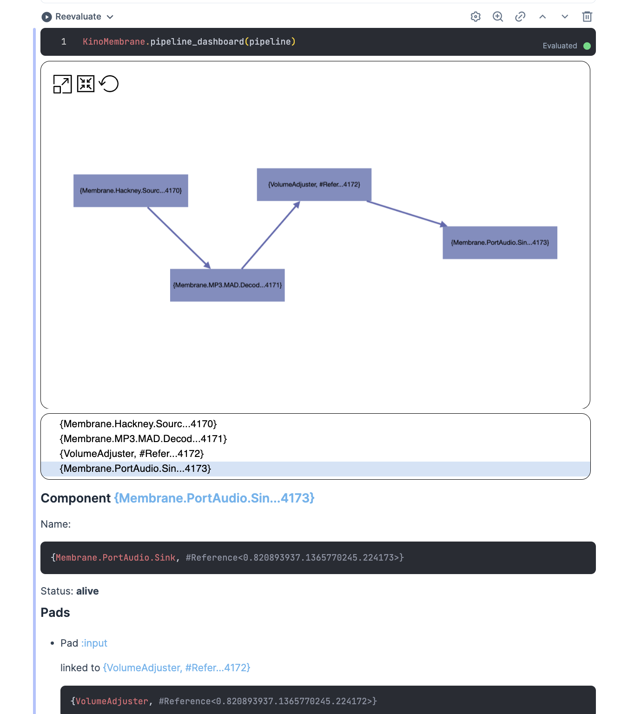

# Observability & logging

To observe and debug Membrane, you can use a variety of tools provided by the BEAM, like [observer](https://www.erlang.org/doc/man/observer.html) or [Process.info](https://hexdocs.pm/elixir/1.15.5/Process.html#info/1). Apart from them, Membrane provides dedicated utilities for observability and logging.

## Introspecting pipelines with kino_membrane

[kino_membrane](https://github.com/membraneframework/kino_membrane) allows for introspecting Membrane pipelines in [Livebook](https://livebook.dev). You can either run the pipeline inside livebook ([see example](https://hexdocs.pm/kino_membrane/pipeline_in_livebook.html)) or connect to a running VM ([see example](https://hexdocs.pm/kino_membrane/connect_to_node.html)). Then, it's enough to install kino_membrane:

```elixir
Mix.install([:kino_membrane])
```

and run

```elixir
KinoMembrane.pipeline_dashboard(pipeline_pid)
```

in Livebook, and you'll get a panel with the pipeline graph, metrics and other utilities:



Check [kino_membrane](https://github.com/membraneframework/kino_membrane) for details.

## Logging

Apart from the usual `Logger` configuration, logging in Membrane can be additionally configured, also via Elixir's `Config`. It allows to enable verbose mode and customize metadata, for example:

```elixir
import Config
config :membrane_core, :logger, verbose: true
```

See [`Membrane.Logger`](https://hexdocs.pm/membrane_core/Membrane.Logger.html) for details.

Moreover, in a pipeline or bin, you can add logger metadata to the [children spec](https://hexdocs.pm/membrane_core/Membrane.ChildrenSpec.html):

```elixir
@impl true
def handle_init(_ctx, opts) do
  spec = {
    child(Some.Element) |> child(Some.Bin),
    log_metadata: [pipeline_id: opts.id]
  }

  {[spec: spec], state}
end
```

and it will add the `pipeline_id` metadata key to all the logs coming from `Some.Element` and `Some.Bin` and all its descendants.

To have the metadata displayed in the logs, you need to configure it as well:
```elixir
import Config
config :logger, :console, metadata: [:pipeline_id]
```
