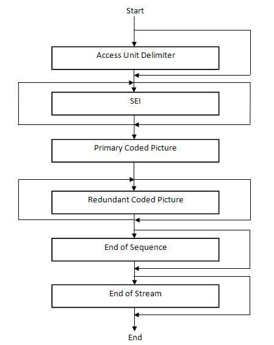
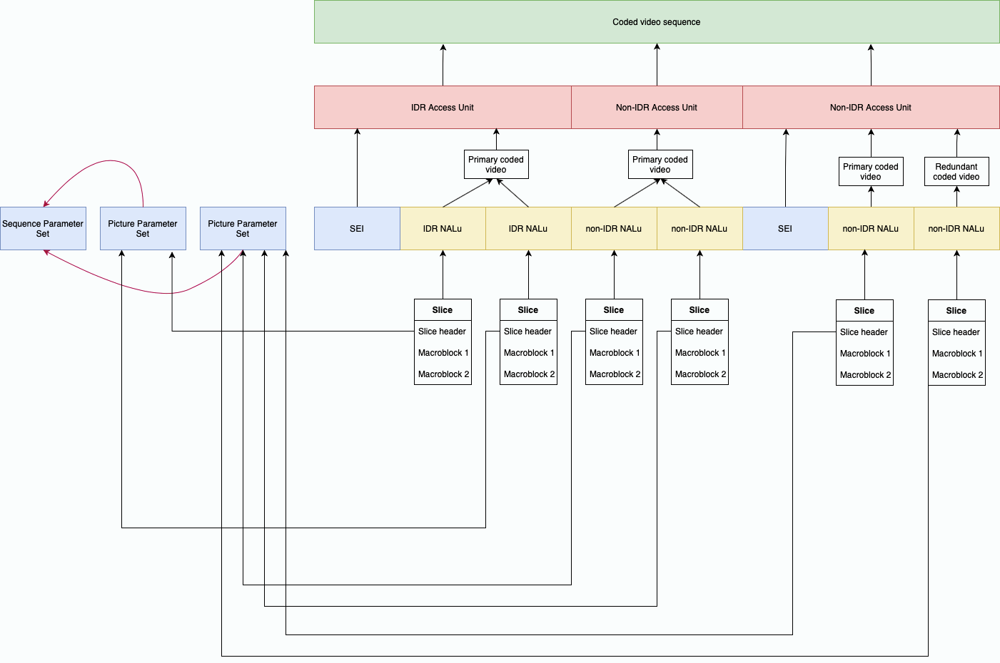

A video is a sequence of *frames* - images. Each frame might be (but it's not obliged to be!) written with [interlacing](https://en.wikipedia.org/wiki/Interlaced_video) - which means: it might consist of two *fields*. In such a case, a *field* is a group of alternating rows of a frame (even or odd ones). The two fields that form a single frame are referred to as the *bottom field* and the *top field*. 

In H.264, the term *picture* refers to both a single field of a frame, or to the frame itself. 

As noted previously, a H.264 stream consists of NAL units. Some NAL units hold the compressed video, while the others hold some metadata. The NAL units that hold video contain it in the form of a *slice*. Each slice is a group of *macroblocks* (along with a so-called *slice header*, containing some metadata). Right now it's sufficient for you to think about a macroblock as an area of 16x16 pixels on an image. Each picture is partitioned into macroblocks and such a division allows intra-frame prediction, as the translation vectors are defined between macroblocks of two pictures. We have reached the bottom - a macroblock is an atomic term in the context of H.264. 

Getting back to the slices - one or more slices create a *coded picture* - a compressed representation of a picture or a part of a picture (remember that a picture is a single video frame or a field). A coded picture might be one of two types:
* a *primary coded picture* -  a coded representation of a whole picture - it contains all the macroblocks of a picture (that means, that it's enough for a decoder to be able to display a picture based just on the primary coded picture)
* a *redundant coded picture* - a coded representation of a part of or a whole picture - as the name suggests ("redundant"), it repeats some information contained by a given primary coded picture
With the primary coded picture defined, we can define another crucial term used in H.264 - *access unit*.
An access unit is a sequence of NAL units that contain exactly one primary coded picture. Apart from the primary coded picture, a single access unit might also contain some *redundant coded pictures* (as well as some other video data or metadata, but let's not dig into the details). The crucial thing is that decoding a single access unit allows one to obtain a single *decoded picture*.
Below there is a scheme that shows a possible structure of an access unit:

      

As shown, an access unit might or might not start with a special type of NALu - access unit delimiter. Then comes zero or more SEI NAL units. Finally, there is the only obligatory part of the access unit - the sequence of NAL units that form a primary coded picture. Then comes zero or more sequences of NAL units forming redundant coded pictures. Then there is optionally the end of sequence NAL unit (it might help in separating the coded video sequences - you will learn what a coded video sequence is very soon). Finally, the end of stream NAL unit might optionally be present if the stream ends (but in the same manner as previously, it's not obligatory - the stream might end without the End of stream NAL unit appearing). 
The access unit might be of two types:
* IDR access unit - an access unit, in which primary coded picture is an IDR picture
* non-IDR access unit - an access unit, in which primary coded picture is not an IDR picture
Finally, we can define a coded video sequence - a sequence of access units that consists of exactly one IDR access unit at the beginning of the sequence, followed by zero or more non-IDR access units.

## Example - H.264 stream structure

Below there is an exemplary H.264 stream consisting of multiple NAL units. The NAL units are forming Access Units, and the Access Units are gathered together in the form of a Coded Video Sequence.

      

Let's thoroughly inspect that stream's structure. 
First, there is a Sequence Parameter Set NAL. It contains some metadata common for zero or more coded video sequences. 
It's followed by two Picture Parameter Set NAL units - each of them contains some metadata relevant for zero or more coded pictures. In the slice's header of each NALu holding the video data (that is - IDR NALu or non-IDR NALu), there is a reference to the particular Picture Parameter Set NALu. Note that all the slices forming a single coded picture must refer to the same Picture Parameter Set NALu. In each Picture Parameter Set NALu, there is a reference to a Sequence Parameter Set - all the Picture Parameter Sets referred to by coded pictures from the same coded video sequence must refer to the same Sequence Parameter Set.
Right after the second Picture Parameter Set NALu a coded video sequence starts. It consists of three access units - the first one is an IDR access unit, while the remaining two are non-IDR access units. 
The first access unit starts with an optional SEI NALu, followed by two IDR NAL units. These two IDR NAL units form a single primary coded picture. The second access unit consists of two non-IDR NAL units, which also form a single primary coded video. That second access unit is probably much smaller in size compared to the first access unit - that is because it doesn't contain a keyframe. The last access unit starts with an optional SEI NALu, followed by a non-IDR NALu (which holds a complete primary coded picture) and an optional redundant coded picture that is contained in a single non-IDR NALu.
